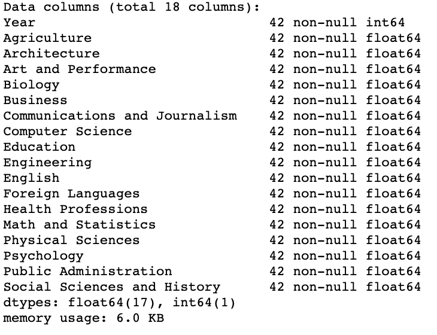
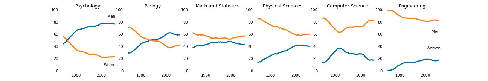
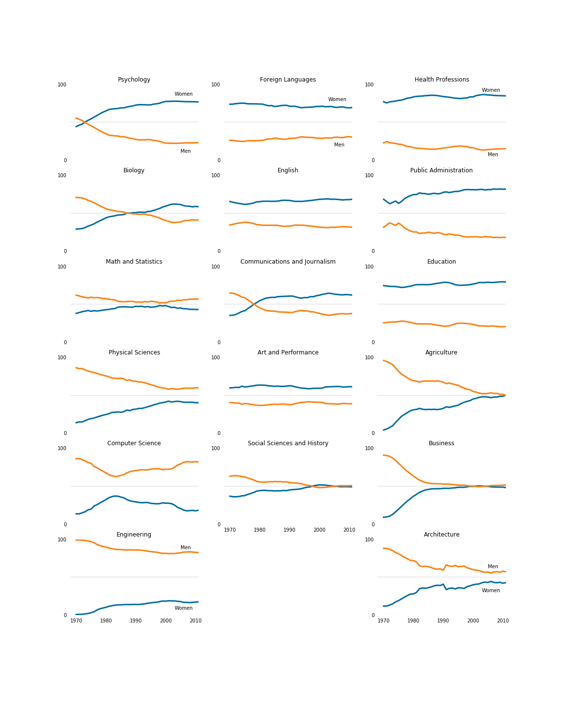

# Gender Gap in College Degress

[The Department of Education Statistics](https://nces.ed.gov/programs/digest/2013menu_tables.asp) releases a data set annually containing the percentage of bachelor's degrees granted to women from 1970 to 2012. The data set is broken up into 17 categories of degrees, with each column as a separate category.

Randal Olson, a data scientist at University of Pennsylvania, has cleaned the data set and made it available on his personal website [here.](http://www.randalolson.com/wp-content/uploads/percent-bachelors-degrees-women-usa.csv)

Randal compiled this data set to explore the gender gap in STEM fields, which stands for science, technology, engineering, and mathematics. This gap is reported on often in the news and not everyone agrees that there is a gap.

For the purpose of this project, we created some visualizations to show the gender gap in college degrees.

### Prerequisites

1. Anaconda - navigator for using Jupyther notebook. 
2. Python

### Packages Used

1. Pandas
2. Matplotlib

### Data Cleaning

Since the data was already cleaned, we could start with analysis and visualizations right away. However, we used info() method to make sure all the types were matched. 

As you can see in the images, all of the types were float. Therefore, we could start creating visualization.

### Data Visualization

1. Colors: We used RGB color codes to select the colors which were easy to see for our color-blinded audience.
2. Graph chart: We used line chart to better see the gender gap in different college majors.
3. We first compared the gender gap in STEM majors.

4. We then created a visualization to see the gender gap among the other majors.

### Conclusion

1. Gender Gap in STEM majors:
- As shown in the charts above, the huge gender gap is in the Engineer majors. It shows that the percentage of men graduates in Engineering major is much higher than women.On the other hand, there is a small gender gap in Math and Statistics Majors.

-  One interesting fact is that in 1980s there were more women graduting Computer Science major than 2010s.

2. Gender Gap in Non Stem Majors:
- the largest gaps between the genders in different majors in 2000s, are among the Health Professionals, Public Administrations, Education, Computer Science and Engineering.

